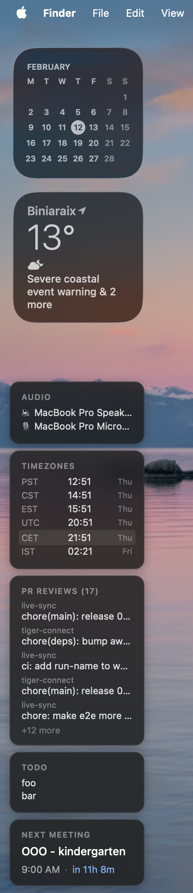

# macos-widgets

[Übersicht](https://tracesof.net/uebersicht/) widgets for macOS.



## Widgets

| Widget | File | Description |
|--------|------|-------------|
| Stack | `stack.jsx` | Container that vertically stacks all widgets into a single card column, runs their commands, and provides shared styles |
| Claude Code | `widgets/claude-sessions.jsx` | Lists active Claude Code sessions in Ghostty; click to switch tab |
| Audio I/O | `widgets/audio.jsx` | Shows current audio input and output devices; click label to open System Settings > Sound |
| Timezones | `widgets/timezones.jsx` | Shows current time in PST, CST, EST, UTC, CET, and IST |
| GitHub PRs | `widgets/github-prs.jsx` | Shows PRs awaiting your review via `gh` CLI with color-coded repo names |
| TODO | `widgets/todo.jsx` | Displays contents of `~/TODO.txt` |
| Next Meeting | `widgets/next-meeting.jsx` | Shows the next upcoming Google Calendar event with start time and countdown |

## Dependencies

- [Übersicht](https://tracesof.net/uebersicht/) — `brew install --cask ubersicht`
- [Ghostty](https://ghostty.org/) — terminal emulator, used by the Claude Code widget. `brew install --cask ghostty`
- [gog](https://github.com/steipete/gogcli) — Google Calendar CLI, used by the next-meeting widget. `brew install steipete/tap/gogcli`, then `gog auth login` to authenticate.

## How it works

Each widget is a separate file in `widgets/`. The `stack.jsx` template contains the shared layout, styles, and a `// {{WIDGETS}}` placeholder. Running `make deploy`:

1. Concatenates all `widgets/*.jsx` into the placeholder position in `stack.jsx`
2. Outputs the result to `build/stack.jsx`
3. Copies it to the Übersicht widgets directory
4. Refreshes Übersicht

## Usage

```
make deploy
```
