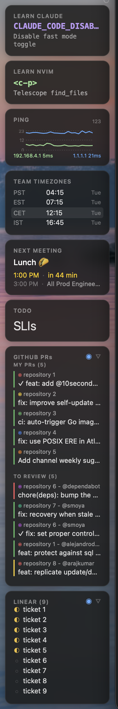

# macos-widgets

[Übersicht](https://tracesof.net/uebersicht/) widgets for macOS.



## Widgets

| Widget | File | Description | Click action |
|--------|------|-------------|--------------|
| Stack | `stack.jsx` | Container that vertically stacks all widgets into a single card column, runs their commands, and provides shared styles | Refresh button re-runs all commands |
| Learn Claude | `widgets/claude-skills.jsx` | Shows a random Claude Code skill, keyboard shortcut, slash command, or env var | Header refreshes to show a new item |
| Learn Nvim | `widgets/nvim-keys.jsx` | Shows a random neovim keymap from `~/.config/nvim/init.lua` | Header refreshes to show a new keymap |
| Ping | `widgets/ping.jsx` | Pings gateway and 1.1.1.1, shows latency as big color-coded numbers | — |
| Timezones | `widgets/timezones.jsx` | Shows current time in PST, CST, EST, UTC, CET, and IST | — |
| Next Meeting | `widgets/next-meeting.jsx` | Shows the next Google Calendar event with time, countdown, and meeting link. Shows the following meeting's time below | Meeting link icon opens Google Meet/Zoom |
| TODO | `widgets/todo.jsx` | Displays first line of `~/TODO.txt`; title shows total line count | Opens `~/TODO.txt` |
| GitHub PRs | `widgets/github-prs.jsx` | Shows your open PRs and PRs awaiting your review (max 5 each) via `gh` CLI with color-coded repo names. Redact toggle hides repo/PR names | Header opens GitHub PRs page; each PR opens its URL |
| Linear | `widgets/linear-tickets.jsx` | Shows assigned Linear tickets sorted by priority with state icons. Redact toggle hides ticket titles | Each ticket opens its Linear URL |

## Dependencies

- [Übersicht](https://tracesof.net/uebersicht/) — `brew install --cask ubersicht`
- [gog](https://github.com/steipete/gogcli) — Google Calendar CLI, used by the next-meeting widget. `brew install steipete/tap/gogcli`, then `gog auth login` to authenticate.

## How it works

Each widget is a separate file in `widgets/`. The `stack.jsx` template contains the shared layout, styles, and a `// {{WIDGETS}}` placeholder. Running `make deploy`:

1. Concatenates all `widgets/*.jsx` into the placeholder position in `stack.jsx`
2. Outputs the result to `build/stack.jsx`
3. Copies it to the Übersicht widgets directory
4. Refreshes Übersicht

## Usage

```
make deploy        # build and deploy to Übersicht
make screenshot    # capture widget area to screenshot-XX.png
```
