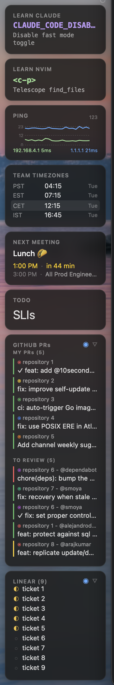

# macos-widgets

[Übersicht](https://tracesof.net/uebersicht/) widgets for macOS.



## Widgets

| Widget | File | Description | Click action |
|--------|------|-------------|--------------|
| Stack (left) | `stack.jsx` | Container that vertically stacks all widgets into a single card column, runs their commands, and provides shared styles | Refresh button re-runs all commands |
| Stack (right) | `stackRight.jsx` | Second vertical stack positioned at the bottom-right of the screen | Refresh button re-runs all commands |
| Learn Claude | `widgets/claude-skills.jsx` | Shows a random Claude Code skill, keyboard shortcut, slash command, or env var | Header refreshes to show a new item |
| Learn Nvim | `widgets/nvim-keys.jsx` | Shows a random neovim keymap from `~/.config/nvim/init.lua` | Header refreshes to show a new keymap |
| Ping | `widgets/ping.jsx` | Pings gateway and 1.1.1.1, shows latency as big color-coded numbers | — |
| Week | `widgets/week.jsx` | Single-row calendar view of the current week (Mon-Sun) with month header; today's day letter and date are shown in red, weekends dimmed | Header refreshes |
| Timezones | `widgets/timezones.jsx` | Shows current time in PST, CST, EST, UTC, CET, and IST | — |
| Next Meeting | `widgets/next-meeting.jsx` | Shows the next Google Calendar event with time, countdown, and meeting link. Shows the following meeting's time below | Meeting link icon opens Google Meet/Zoom |
| TODO | `widgets/todo.jsx` | Renders `~/TODO.txt` as a GitHub-flavored markdown checklist: `- [ ]` / `- [x]` lines become numbered rows (index starts at 0) with HTML checkboxes; checked items are struck through. Indented items (2-space steps) render as nested children with a `◦` marker. Markdown links `[text](url)` inside item text are clickable and open in the default browser. Lines after a `---` separator are hidden but counted in the title | Opens `~/TODO.txt`; links open their URL |
| GitHub PRs | `widgets/github-prs.jsx` | Shows your open PRs and PRs awaiting your review (max 5 each) via `gh` CLI with color-coded repo names. Bot authors (timescale-automation, github-actions, dependabot) are filtered from the review list. Redact toggle hides repo/PR names | Header opens GitHub PRs page; each PR opens its URL |
| Linear | `widgets/linear-tickets.jsx` | Shows assigned Linear tickets sorted by priority with state icons. Redact toggle hides ticket titles | Each ticket opens its Linear URL |
| Image | `widgets-right/image.jsx` | Displays an image from a URL or local path in `~/WIDGET_IMAGE`, resized to widget width. Title shows filename | Opens URL in browser (remote) or file in Preview (local) |
| Image 2 | `widgets-right/image2.jsx` | Second image slot: same behavior as Image but reads the source path/URL from `~/WIDGET_IMAGE_2` | Opens URL in browser (remote) or file in Preview (local) |

## Dependencies

- [Übersicht](https://tracesof.net/uebersicht/) — `brew install --cask ubersicht`
- [gog](https://github.com/steipete/gogcli) — Google Calendar CLI, used by the next-meeting widget. `brew install steipete/tap/gogcli`, then `gog auth login` to authenticate.

## How it works

Each widget is a separate file in `widgets/`. The `stack.jsx` template contains the shared layout, styles, and a `// {{WIDGETS}}` placeholder. Running `make deploy`:

1. Concatenates all `widgets/*.jsx` into the placeholder position in `stack.jsx`
2. Outputs the result to `build/stack.jsx`
3. Copies it to the Übersicht widgets directory
4. Refreshes Übersicht

## Usage

```
make deploy        # build and deploy to Übersicht
make screenshot    # capture widget area to screenshot-XX.png
```
