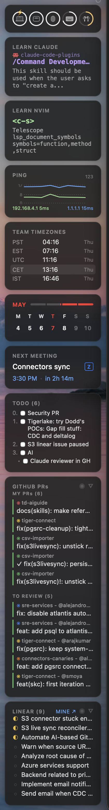

# macos-widgets

[Übersicht](https://tracesof.net/uebersicht/) widgets for macOS.



## Widgets

| Widget | File | Description | Click action |
|--------|------|-------------|--------------|
| Stack (left) | `stack.jsx` | Container that vertically stacks all widgets into a single card column, runs their commands, and provides shared styles | Refresh button re-runs all commands |
| Stack (right) | `stackRight.jsx` | Second vertical stack positioned at the bottom-right of the screen | Refresh button re-runs all commands |
| Learn Claude | `widgets/claude-skills.jsx` | Shows a random Claude Code skill dynamically discovered from `~/.claude/skills` (manually installed) and `~/.claude/plugins/marketplaces` (plugin-shipped) | Header refreshes to show a new skill |
| Learn Nvim | `widgets/nvim-keys.jsx` | Shows a random neovim keymap from `~/.config/nvim/init.lua` | Header refreshes to show a new keymap |
| Ping | `widgets/ping.jsx` | Pings gateway and 1.1.1.1; header shows compact `gw / dns` ms (green/blue) next to the title, with a toggle between sparkline graph and big color-coded numbers | Header icon toggles graph ↔ numbers |
| Battery | `widgets/battery.jsx` | Single-row ring gauges for Mac, AirPods buds, AirPods case, Magic Keyboard, and mouse. Mac level/charging from `pmset`, Bluetooth devices from `system_profiler SPBluetoothDataType`, keyboard battery from `ioreg`. Icon glyphs are bundled PNGs (`battery-laptop.png`, `battery-airpods.png`, `battery-case.png`, `battery-keyboard.png`, `battery-mouse.png`). Ring color goes yellow under 50% and red under 25% (same `#ff453a` as the Week widget); charging shows a yellow ⚡ above the ring. Ring size auto-shrinks (28–42px) so 1–5 devices all fit in the row | Click anywhere on the row refreshes |
| Timezones | `widgets/timezones.jsx` | Shows current time in PST, CST, EST, UTC, CET, and IST. Collapsed by default to just the last two (CET, IST) | Header toggles between collapsed (last 2) and expanded (all 6) |
| Calendar | `widgets/calendar.jsx` | Combined week view + next Google Calendar meeting in one card. Top: single-row Mon-Sun grid with a workday progress bar in the month header (9-18h, Wed ends at 16h) that shrinks right-to-left; in the final hour a red `Xm` label appears next to it. Today in red, weekends dimmed and bar hidden. Bottom: next meeting with time, countdown, and meeting link, plus the following meeting's time when it starts within an hour. Skips events where every other (non-self, non-room) attendee has declined. Pulses with a red border when the next meeting starts within 5 minutes | Month header refreshes; click dates to expand 3 more weeks; meeting link icon opens Google Meet/Zoom |
| TODO | `widgets/todo.jsx` | Renders `~/TODO.txt` as a GitHub-flavored markdown checklist: `- [ ]` / `- [x]` lines become numbered rows (index starts at 0) with HTML checkboxes; checked items are struck through. Indented items (2-space steps) render as nested children with a `◦` marker. Markdown links `[text](url)` inside item text are clickable and open in the default browser. The file is split by `---` into three parts: (1) visible TODOs, (2) low-prio TODOs hidden behind a `+ N` toggle in the header, (3) free-text scratch never rendered | TODO label refreshes; `✓ N` toggles hiding done items (along with their nested descendants); `+ N` / `− N` toggles low-prio block; clicking a checkbox toggles `[ ]` ↔ `[x]` in `~/TODO.txt` and refreshes; clicking elsewhere on the list opens `~/TODO.txt`; links open their URL |
| GitHub PRs | `widgets/github-prs.jsx` | Shows your open PRs and PRs awaiting your review (max 5 each) via `gh` CLI with color-coded repo names. Bot authors (timescale-automation, github-actions, dependabot) and archived repos are filtered from the review list, as are PRs you've already reviewed where no new commits have landed since your last review. Redact toggle hides repo/PR names | Header opens GitHub PRs page; each PR opens its URL |
| Linear | `widgets/linear-tickets.jsx` | Shows assigned Linear tickets sorted by priority with state icons. Redact toggle hides ticket titles | Each ticket opens its Linear URL |
| Learn English | `widgets-right/learn-english.jsx` | Shows a random phrase from `~/english.txt` (one phrase per line, `#` comments skipped). Seeded with business/work-focused English phrases and idioms | Header refreshes to show a new phrase; clicking the phrase opens `~/english.txt` |
| Image | `widgets-right/image.jsx` | Displays an image from a URL or local path in `~/WIDGET_IMAGE`, resized to widget width. Title shows filename | Opens URL in browser (remote) or file in Preview (local) |
| Image 2 | `widgets-right/image2.jsx` | Second image slot: same behavior as Image but reads the source path/URL from `~/WIDGET_IMAGE_2` | Opens URL in browser (remote) or file in Preview (local) |

## Dependencies

- [Übersicht](https://tracesof.net/uebersicht/) — `brew install --cask ubersicht`
- [gog](https://github.com/steipete/gogcli) — Google Calendar CLI, used by the next-meeting widget. `brew install steipete/tap/gogcli`, then `gog auth login` to authenticate.

## How it works

Each widget is a separate file in `widgets/`. The `stack.jsx` template contains the shared layout, styles, and a `// {{WIDGETS}}` placeholder. Running `make deploy`:

1. Concatenates all `widgets/*.jsx` into the placeholder position in `stack.jsx`
2. Outputs the result to `build/stack.jsx`
3. Copies it to the Übersicht widgets directory
4. Refreshes Übersicht

## Usage

```
make deploy        # build and deploy to Übersicht
make screenshot    # capture widget area to screenshot-XX.png
```
